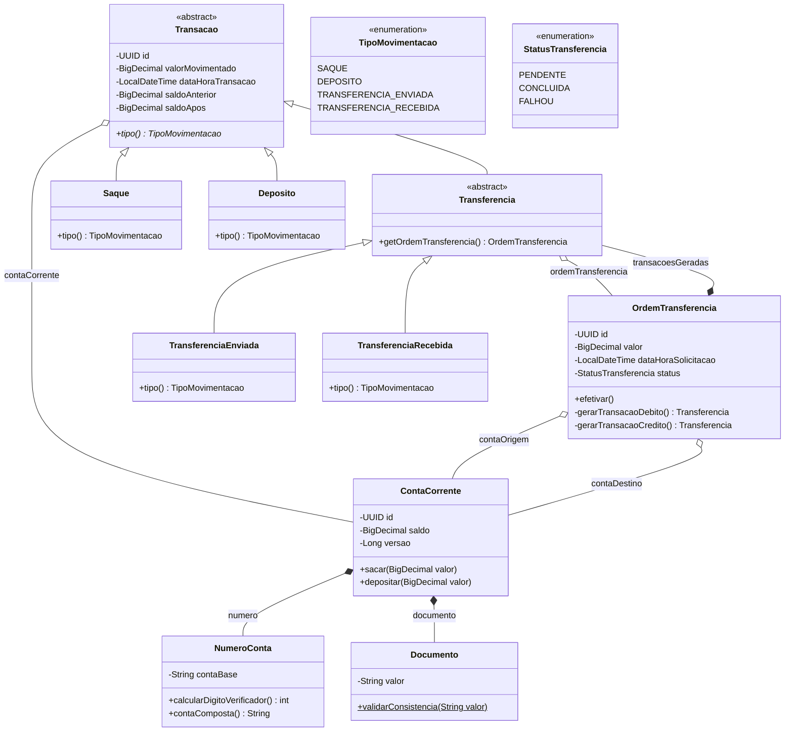
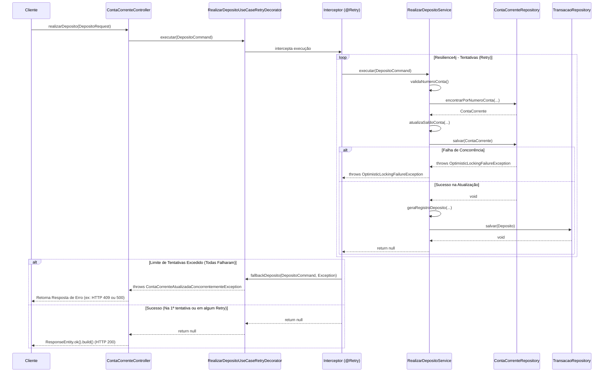

# Diagrama de classes

```mermaid

classDiagram

    %% Records / Value Objects
    class Documento {
        -String valor
        +validarConsistencia(String valor)$
    }

    class NumeroConta {
        -String contaBase
        +calcularDigitoVerificador() int
        +contaComposta() String
    }

    %% Entidade Principal
    class ContaCorrente {
        -UUID id
        -BigDecimal saldo
        -Long versao
        +sacar(BigDecimal valor)
        +depositar(BigDecimal valor)
    }

    %% Agrupamento Transacao
    class Transacao {
        <<abstract>>
        -UUID id
        -BigDecimal valorMovimentado
        -LocalDateTime dataHoraTransacao
        -BigDecimal saldoAnterior
        -BigDecimal saldoApos
        +tipo()* TipoMovimentacao
    }

    class Saque {
        +tipo() TipoMovimentacao
    }

    class Deposito {
        +tipo() TipoMovimentacao
    }

    class Transferencia {
        <<abstract>>
        +getOrdemTransferencia() OrdemTransferencia
    }

    class TransferenciaEnviada {
        +tipo() TipoMovimentacao
    }

    class TransferenciaRecebida {
        +tipo() TipoMovimentacao
    }

    %% Ordem de Transferência
    class OrdemTransferencia {
        -UUID id
        -BigDecimal valor
        -LocalDateTime dataHoraSolicitacao
        -StatusTransferencia status
        +efetivar()
        -gerarTransacaoDebito() Transferencia
        -gerarTransacaoCredito() Transferencia
    }

    class TipoMovimentacao {
        <<enumeration>>
        SAQUE
        DEPOSITO
        TRANSFERENCIA_ENVIADA
        TRANSFERENCIA_RECEBIDA
    }

    class StatusTransferencia {
        <<enumeration>>
        PENDENTE
        CONCLUIDA
        FALHOU
    }

    %% Relacionamentos

    %% Associações Conta Corrente
    ContaCorrente *-- NumeroConta : numero
    ContaCorrente *-- Documento : documento

    %% Associações Transação
    Transacao o-- ContaCorrente : contaCorrente
    Transacao <|-- Saque
    Transacao <|-- Deposito
    Transacao <|-- Transferencia

    %% Heranças Transferência
    Transferencia <|-- TransferenciaEnviada
    Transferencia <|-- TransferenciaRecebida
    Transferencia o-- OrdemTransferencia : ordemTransferencia

    %% Associações Ordem de Transferência
    OrdemTransferencia o-- ContaCorrente : contaOrigem
    OrdemTransferencia o-- ContaCorrente : contaDestino
    OrdemTransferencia *-- Transferencia : transacoesGeradas
```

# Diagrama sequencial fluxo resiliente concorrência depósito/saque/transferência

```mermaid
sequenceDiagram
    participant Cliente
    participant Controller as ContaCorrenteController
    participant Decorator as RealizarDepositoUseCaseRetryDecorator
    participant Resilience4j as Interceptor (@Retry)
    participant Service as RealizarDepositoService
    participant ContaRepo as ContaCorrenteRepository
    participant TransacaoRepo as TransacaoRepository

    Cliente->>Controller: realizarDeposito(DepositoRequest)
    Controller->>Decorator: executar(DepositoCommand)
  
    %% O interceptor do Resilience4j captura a chamada devido à anotação @Retry
    Decorator->>Resilience4j: intercepta execução
  
    loop Resilience4j - Tentativas (Retry)
        Resilience4j->>Service: executar(DepositoCommand)
        Service->>Service: validaNumeroConta()
      
        Service->>ContaRepo: encontrarPorNumeroConta(...)
        ContaRepo-->>Service: ContaCorrente
      
        Service->>Service: atualizaSaldoConta(...)
        Service->>ContaRepo: salvar(ContaCorrente)
      
        alt Falha de Concorrência
            ContaRepo-->>Service: throws OptimisticLockingFailureException
            Service-->>Resilience4j: throws OptimisticLockingFailureException
            %% O Resilience4j vai aguardar o tempo configurado e tentar novamente
        else Sucesso na Atualização
            ContaRepo-->>Service: void
            Service->>Service: geraRegistroDeposito(...)
            Service->>TransacaoRepo: salvar(Deposito)
            TransacaoRepo-->>Service: void
            Service-->>Resilience4j: return null
        end
    end

    alt Limite de Tentativas Excedido (Todas Falharam)
        Resilience4j->>Decorator: fallbackDeposito(DepositoCommand, Exception)
        Decorator-->>Controller: throws ContaCorrenteAtualizadaConcorrentementeException
        Controller-->>Cliente: Retorna Resposta de Erro (ex: HTTP 409 ou 500)
    else Sucesso (Na 1ª tentativa ou em algum Retry)
        Resilience4j-->>Decorator: return null
        Decorator-->>Controller: return null
        Controller-->>Cliente: ResponseEntity.ok().build() (HTTP 200)
    end
```
