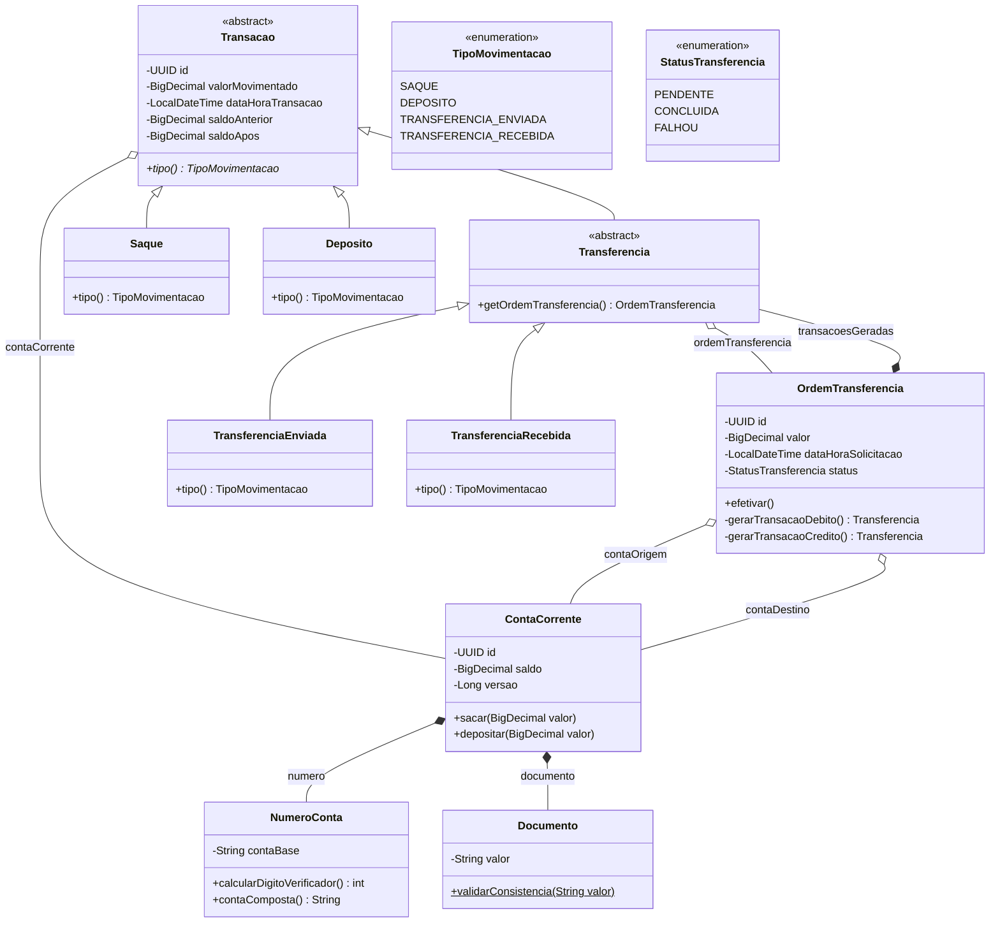

# Diagrama de classes

```mermaid

classDiagram

    %% Records / Value Objects
    class Documento {
        -String valor
        +validarConsistencia(String valor)$
    }

    class NumeroConta {
        -String contaBase
        +calcularDigitoVerificador() int
        +contaComposta() String
    }

    %% Entidade Principal
    class ContaCorrente {
        -UUID id
        -BigDecimal saldo
        -Long versao
        +sacar(BigDecimal valor)
        +depositar(BigDecimal valor)
    }

    %% Agrupamento Transacao
    class Transacao {
        <<abstract>>
        -UUID id
        -BigDecimal valorMovimentado
        -LocalDateTime dataHoraTransacao
        -BigDecimal saldoAnterior
        -BigDecimal saldoApos
        +tipo()* TipoMovimentacao
    }

    class Saque {
        +tipo() TipoMovimentacao
    }

    class Deposito {
        +tipo() TipoMovimentacao
    }

    class Transferencia {
        <<abstract>>
        +getOrdemTransferencia() OrdemTransferencia
    }

    class TransferenciaEnviada {
        +tipo() TipoMovimentacao
    }

    class TransferenciaRecebida {
        +tipo() TipoMovimentacao
    }

    %% Ordem de Transferência
    class OrdemTransferencia {
        -UUID id
        -BigDecimal valor
        -LocalDateTime dataHoraSolicitacao
        -StatusTransferencia status
        +efetivar()
        -gerarTransacaoDebito() Transferencia
        -gerarTransacaoCredito() Transferencia
    }

    class TipoMovimentacao {
        <<enumeration>>
        SAQUE
        DEPOSITO
        TRANSFERENCIA_ENVIADA
        TRANSFERENCIA_RECEBIDA
    }

    class StatusTransferencia {
        <<enumeration>>
        PENDENTE
        CONCLUIDA
        FALHOU
    }

    %% Relacionamentos

    %% Associações Conta Corrente
    ContaCorrente *-- NumeroConta : numero
    ContaCorrente *-- Documento : documento

    %% Associações Transação
    Transacao o-- ContaCorrente : contaCorrente
    Transacao <|-- Saque
    Transacao <|-- Deposito
    Transacao <|-- Transferencia

    %% Heranças Transferência
    Transferencia <|-- TransferenciaEnviada
    Transferencia <|-- TransferenciaRecebida
    Transferencia o-- OrdemTransferencia : ordemTransferencia

    %% Associações Ordem de Transferência
    OrdemTransferencia o-- ContaCorrente : contaOrigem
    OrdemTransferencia o-- ContaCorrente : contaDestino
    OrdemTransferencia *-- Transferencia : transacoesGeradas
```